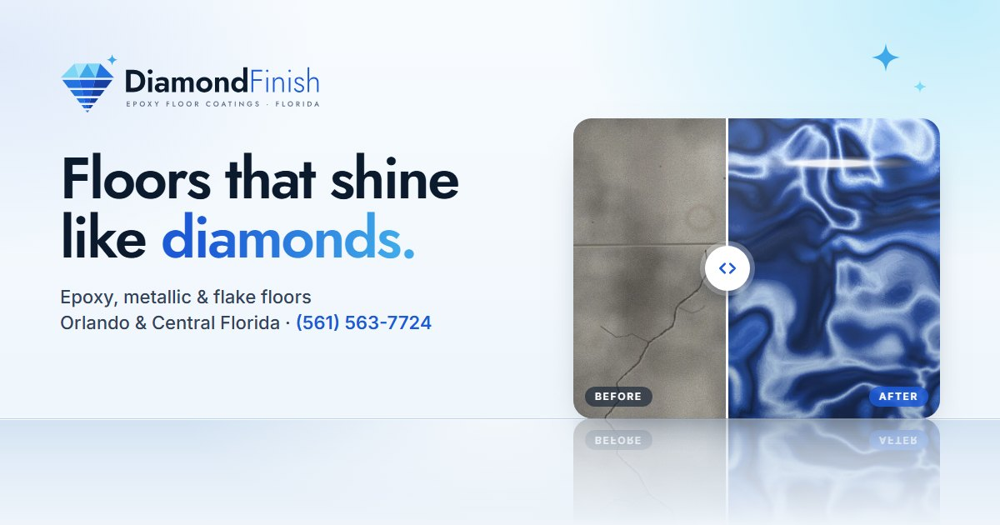

# DiamondFinish

Marketing website for a Florida epoxy flooring company, built as a portfolio piece: logo, brand palette and a one-page site. Plain HTML, CSS and JavaScript, no build step and no dependencies.

Live at **[diamondfinish.live](https://diamondfinish.live)**, hosted on Netlify.



## The brand

"Mirror Gloss": a cut diamond whose lower half dissolves into gloss lines, like its reflection in a freshly coated floor. The idea carries into the site: the hero's before/after sample board and its buttons stand on a glossy floor and reflect in it.

| Colour | Hex | Used for |
| --- | --- | --- |
| Ink | `#0C1A2E` | Wordmark, headings, dark sections |
| Sapphire | `#1D5BD6` | "Finish", buttons (5.9:1 with white text) |
| Brilliant | `#3FA9EA` | Gem facets, gradients, sparkles |
| Ice | `#7FDCF6` | Sparkle, accents on dark |
| Silver | `#C7D2DE` | Borders, dividers |
| Frost | `#EDF5FB` | Light sections |

Type: **Jost** SemiBold for headings and the wordmark, **Inter** for body text.

Logo text is converted to vector outlines, so `images/logo.svg` renders identically anywhere, including as an `` and without the fonts installed. The floor textures (bare concrete, flake, metallic and quartz) were generated for this project, so there are no stock photos to license.

## Running it

Open `index.html` directly, or serve the folder:

```bash
python -m http.server 8000
```

VS Code's Live Server works too. All paths are relative to the project root.

## Structure

```
index.html          one page: hero, services, finishes, process, Florida features, reviews, areas, FAQ, estimate form
css/styles.css      tokens → base → layout → components → sections
js/main.js          mobile menu, scroll reveal, active nav link, before/after board, estimate form
images/             logo, favicons, social share image, floor textures
brand/              logo concept sheet from the exploration round
netlify.toml        Netlify config: publish the root as-is, security headers
```

The nav links jump to sections on the one page; there are no separate subpages.

The before/after board in the hero works with a mouse, touch or the keyboard (arrow keys, Home and End), and its buttons switch the finish between flake, metallic and quartz. The reflection uses `-webkit-box-reflect`, so it shows in Chrome, Edge and Safari; Firefox shows the glossy floor without reflections.

## About the content

The business name and phone number are real; everything else is placeholder copy for the demo. The email, reviews, ratings, job counts, warranty terms and claims such as "licensed & insured" are invented and should be replaced before this is used as a live business site. The estimate form validates and shows a confirmation, but sends nothing: there's a marked spot in `js/main.js` for connecting a form service.
